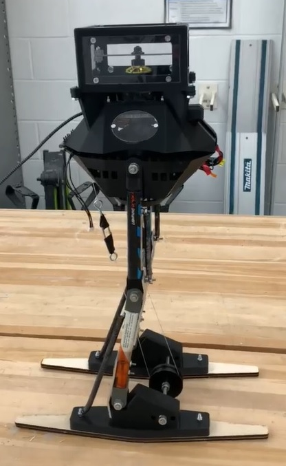

# Jumpy

Jumpy est un robot sauteur réalisé dans le cadre du projet de session de la session 4 en Génie Robotique à l'Université de Sherbrooke. 

## Table des matières

* [UI](/UI#requis)
* [Code contrôle](/Code/mainJumpy#code)
* [CAD](/CAD#CAD)
	
		

## VIDÉOS

[Démonstration du robot](https://www.youtube.com/shorts/cel7XVDD8pQ)

[Démonstration du saut à une jambe](https://www.youtube.com/shorts/icxFYxDteIQ)

[Démonstration de la roue inertielle](https://www.youtube.com/shorts/jROJLMc7-dI)

